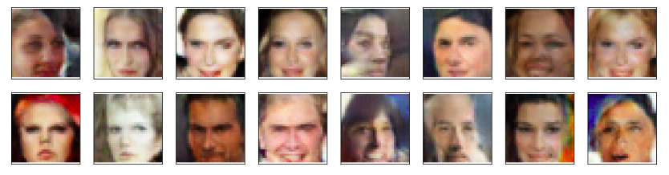

# Project-Face-Generation-with-DCGAN
Create generator network to generate new images of faces that look as realistic as possible.

## Project Overview :
The goal of this project is to get a generator network to generate new images Generative Adversarial Networks of faces that look as realistic as possble.

## Data :
The model is trained on the CelebFaces Attributes Dataset ([CelebFaces Attributes Dataset](https://s3.amazonaws.com/video.udacity-data.com/topher/2018/November/5be7eb6f_processed-celeba-small/processed-celeba-small.zip))

### Sample

## Model architecture :
Discriminator: 5-Layer CNN - Given a face image, distinguishes it as a real or a fake (generated) image and try to minimize the loss usinf back propagation.
Generator: 5-Layer CNN - Given a latent vector z, generates a new face images from learned weights from images in training set. Gole of Generator to make Dircriminator to think that the generated images are real.

## Hyperparameters :
* Batch Size = 64
* Discriminator and Generator dimension = 64* 64
* num_epochs = 20
* learning_rate = 0.0003 with Adam optimizer : [beta1, beta2] = [0.5, 0.999]
* Length of latent vector z = 100

## Training :
Training involved alternating between training the discriminator and the generator.

## Result :

## Libraries :
* PyTorch 

## Device :
* GPU
